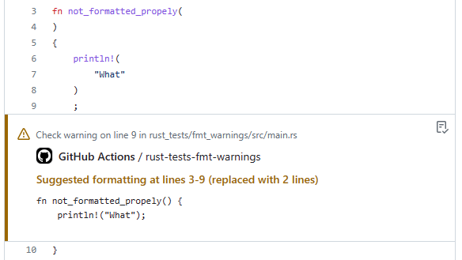

# `rs-fmt-check` Action

_NOTE: This action is a work in progress._

[](LICENSE)
[](https://github.com/clechasseur/rs-clippy-check/actions/workflows/ci.yml)

> Clippy lints in your Pull Requests

This GitHub Action executes [`clippy`](https://github.com/rust-lang/rust-clippy)
and posts all lints as annotations for the pushed commit.



This GitHub Action has been forked from [actions-rs/clippy-check](https://github.com/actions-rs/clippy-check). The original project published under the name [`rust-clippy-check`](https://github.com/marketplace/actions/rust-clippy-check). See [LICENSE](LICENSE) for copyright attribution details.

## Example workflow

Note: this workflow uses [`dtolnay/rust-toolchain`](https://github.com/dtolnay/rust-toolchain) to install the most recent `nightly` clippy.

```yaml
name: Clippy check

on: push

jobs:
  clippy_check:
    runs-on: ubuntu-latest
    steps:
      - uses: actions/checkout@v3
      - uses: dtolnay/rust-toolchain@nightly
        with:
          components: clippy
      - uses: clechasseur/rs-clippy-check@v2
        with:
          args: --all-features
```

## Inputs

All inputs are optional.

| Name | Description | Type | Default |
| --- | --- | --- | --- |
| `toolchain` | Rust toolchain to use; see note below | string | `nightly` |
| `args` | Arguments for the `cargo clippy` command | string |         |
| `use-cross` | Use [`cross`](https://github.com/cross-rs/cross) instead of `cargo` | bool | `false` |
| `working-directory` | Directory where to perform the `cargo clippy` command | string |         |

For extra details about the `toolchain`, `args` and `use-cross` inputs, see [`rs-cargo` Action](https://github.com/clechasseur/rs-cargo#inputs).
