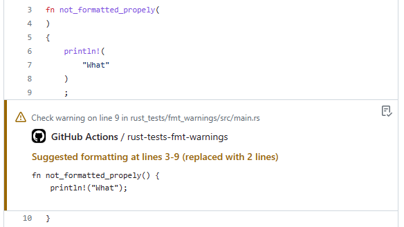

# `rs-fmt-check` Action

[](LICENSE)
[](https://github.com/clechasseur/rs-fmt-check/actions/workflows/ci.yml)

> Rustfmt suggestions in your Pull Requests

This GitHub Action executes [`rustfmt`](https://github.com/rust-lang/rustfmt) and posts all suggestions as annotations for the pushed commit [<sup>2</sup>](#note-annotations-limit).



This GitHub Action is based on [clechasseur/rs-clippy-check](https://github.com/clechasseur/rs-clippy-check), which itself has been forked from [actions-rs/clippy-check](https://github.com/actions-rs/clippy-check).
See [LICENSE](LICENSE) for copyright attribution details.

## Example workflow

Note: this workflow uses [`actions-rust-lang/setup-rust-toolchain`](https://github.com/actions-rust-lang/setup-rust-toolchain) to install the most recent `nightly` rustfmt [<sup>1</sup>](#note-nightly-requirement).

```yaml
name: Rustfmt check

on: push

jobs:
  rustfmt_check:
    runs-on: ubuntu-latest
    steps:
      - uses: actions/checkout@de0fac2e4500dabe0009e67214ff5f5447ce83dd # v6.0.2
      - uses: actions-rust-lang/setup-rust-toolchain@6044e13b5dc448c55e2357c09f80417699197238 # v6.2.0
        with:
          toolchain: nightly
          components: rustfmt
      - uses: clechasseur/rs-fmt-check@v4.0.2
```

## Inputs

All inputs are optional.

| Name | Description                                                     | Type | Default |
| --- |-----------------------------------------------------------------| --- | --- |
| `toolchain` | Rust toolchain to use [<sup>1</sup>](#note-nightly-requirement) | string | `nightly` |
| `args` | Arguments for the `cargo fmt` command                           | string |         |
| `working-directory` | Directory where to perform the `cargo fmt` command              | string |         |

For extra details about the `toolchain` and `args` inputs, see [`rs-cargo` Action](https://github.com/clechasseur/rs-cargo#inputs).

## Release immutability

Starting with release 4.0.0, this GitHub action's releases will be marked as [immutable](https://docs.github.com/en/code-security/concepts/supply-chain-security/immutable-releases). This means that once a release is created, its tag cannot be modified in any way.

Previously, best practices for using GitHub actions in workflows were to pin the actions to a specific Git commit hash. With immutable releases, this is no longer necessary and the actual Git tag is safe to use. Because of this, starting with release 4.0.0, this GitHub action will **no longer provide a floating major version tag** (like `v4`, for example). To use a specific version of this action, pin it to the release tag (like `v4.0.0`).

## Notes

<a name="note-nightly-requirement"><sup>1</sup></a> : This action currently relies on an unstable `rustfmt` feature (`emit json`) and as such, requires a `nightly` toolchain at the minimum. You should not change the value of the `toolchain` parameter unless you know the specified toolchain supports the feature correctly.

<a name="note-annotations-limit"><sup>2</sup></a> : Currently, GitHub sets a limit of 10 warning annotations per run (see [this page](https://docs.github.com/en/rest/checks/runs?apiVersion=2022-11-28) for more information). So if there are more than 10 suggestions returned by `rustfmt`, only the first 10 will appear as PR annotations. The other suggestions will still appear in the check run summary (see [this one](https://github.com/clechasseur/rs-fmt-check/actions/runs/5886828621/attempts/1#summary-15965282231) for example).
